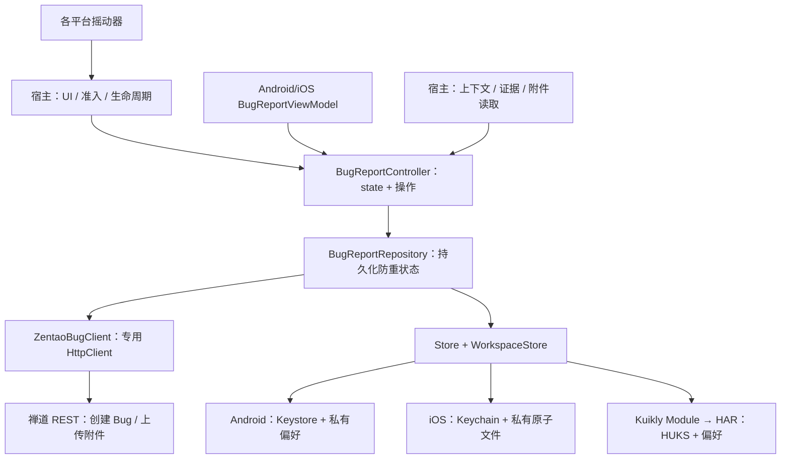
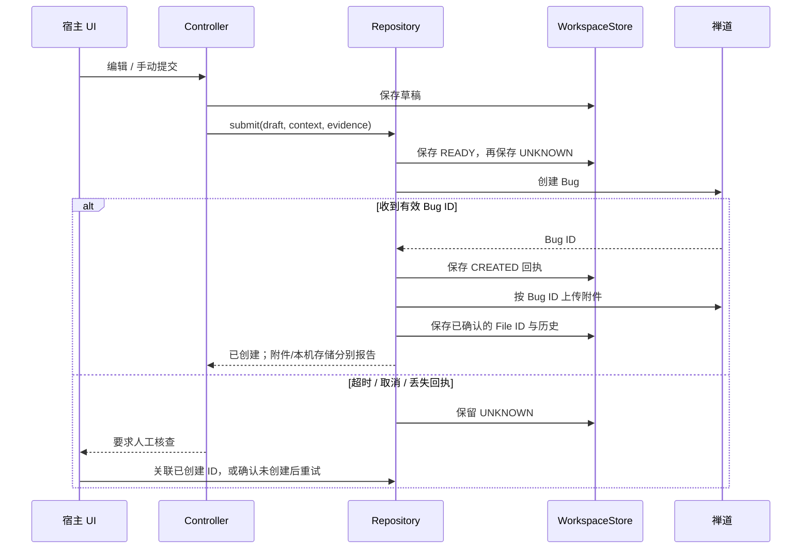
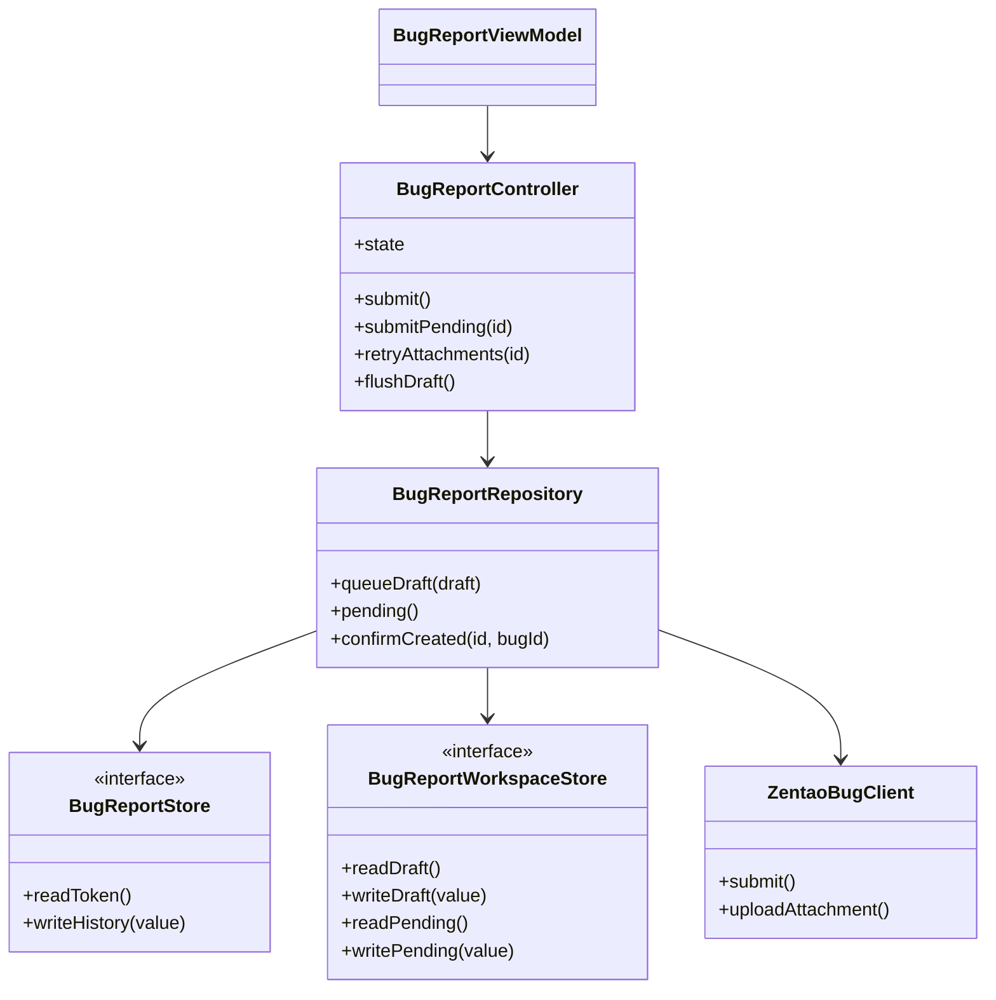

# GY CrossKit Debug Tools

Android、iOS、HarmonyOS 共用的 Bug 上报组件：草稿、提交状态、安全 Token、本机历史、摇动触发、页面轨迹、证据格式化和禅道 REST 协议。保留 `com.dgtang.debugtools.bugreport` API；表单 UI、品牌、导航和诊断采集由宿主提供。

**当前远程版本：`0.1.3`（Android/iOS）。新候选：`0.2.0-rc.1`（三端），正在准备发布，渠道可用性以本文验收记录为准。**

## 本版对齐范围

| 能力 | 0.2.0-rc.1 候选 |
| --- | --- |
| 鸿蒙 Bug 上报 | 共用 Controller/Repository/REST，OHOS KLIB + Kuikly 薄桥 |
| 鸿蒙 Token 存储 | HUKS AES-256-GCM，随机 nonce，普通偏好只保存密文 |
| 鸿蒙摇一摇 | 真实注册回执、阈值/冷却、停止与销毁注销 |
| 三端附件 | 已知 Bug ID 后上传，失败可补传，未知结果先核查 |
| 三端草稿 | 自动保存用户输入，宿主关闭前可等待 flushDraft |
| 三端待提交恢复 | 持久化队列，手动提交；不因启动、联网或授权自动重发 |
| 本地化 | typed notice、内置中文/英文，宿主可映射资源 |

## 架构与调用流程







源码：[共用状态机](src/commonMain/kotlin/com/dgtang/debugtools/bugreport/BugReportController.kt)、[提交与恢复](src/commonMain/kotlin/com/dgtang/debugtools/bugreport/BugReportRepository.kt)、[REST](src/commonMain/kotlin/com/dgtang/debugtools/bugreport/ZentaoBugClient.kt)、[Kuikly 桥](debug-tools-kuikly/src/commonMain/kotlin/com/dgtang/debugtools/kuikly/DebugToolsModule.kt)、[原生 HAR](ohos/debug-tools-native)。

## 支持与安装

| 项目 | 0.2.0-rc.1 候选范围 |
| --- | --- |
| 平台 | Android minSdk 24、iOS Arm64/Simulator Arm64/x64、OHOS Arm64；JVM 用于共用核心消费和测试 |
| 工具链 | Kotlin `2.2.21-1.0.0`、AGP 8.10.1、Gradle 8.11.1、JVM 11；Gradle JDK 17+ |
| 共用依赖 | coroutines `1.10.2-1.0.0`、serialization `1.9.1-1.0.0`、Ktor `3.3.3-1.1.0-04` |
| Android/iOS 包装 | lifecycle-viewmodel 2.10.0；OHOS 核心不依赖 AndroidX |
| 鸿蒙桥 | Kuikly `2.28.0-2.0.21-ohos`，HAR renderer `2.28.0` |
| 原生产物 | Android AAR、iOS/OHOS KLIB、OHOS HAR；没有独立 Pod/SPM/XCFramework |

已发布版本继续使用 JitPack：

```kotlin
implementation("com.github.gycrosskit.debug-tools:debug-tools:0.1.3")
```

候选发布后的三端坐标如下；当前只验证本地 staging，不代表这些版本已经远程可下载：

```kotlin
commonMain.dependencies {
    implementation("com.github.gycrosskit.debug-tools:debug-tools:0.2.0-rc.1")
}
ohosArm64Main.dependencies {
    implementation("com.github.gycrosskit.debug-tools:debug-tools-kuikly:0.2.0-rc.1")
}
```

鸿蒙原生配套包为 `@gycrosskit/debug-tools-native@0.2.0-rc.1`。配置、迁移键、手动恢复和生命周期例子见 [接入指南](docs/接入指南.md)；原生注册见 [HAR README](ohos/debug-tools-native/README.md)。

## 最小接入

```kotlin
// engineClient、target、store、hostDataSource 由宿主提供。
val repository = BugReportRepository(ZentaoBugClient(engineClient, target), store)
// Android/iOS 保留现有 ViewModelStore/Koin 所有权。
val model = BugReportViewModel(repository, hostDataSource)
// Kuikly 使用 BugReportController(pageScope, repository, hostDataSource)。
// 观察 state 并调用 openForm、updateTitle、submit 等操作。
```

宿主负责 HTTPS 目标、产品/分支、账号授权 UI、专用 TLS Engine、存储命名空间、证据与附件准入、脱敏、摇动开关、表单与导航。未开通使用 `BugReportTarget.Unavailable`。账号密码不落盘；远端创建成功与附件失败、本机记录失败分别表达。

`BugEvidenceFormatter` 只限长，不脱敏。组件不会自动截图、采集诊断或恢复联网后重发。Android Release 由宿主排除开发依赖；iOS/OHOS 由正式环境准入禁用，不创建或启动调试摇动器。

Controller 操作使用宿主 UI/Page 的串行 scope；Store 的 suspend 签名不代表可以在任意线程访问平台对象。Android/iOS detector 在主线程生命周期调用；Kuikly Store 与摇动使用所属 Page 的协程，销毁在相同 Kuikly Context 调用 `dispose()`。

## 开发与验证

实际命令、99 项 Kotlin 测试、4 项鸿蒙原生模拟测试、HAR 和产物检查见 [开发与验证](docs/开发与验证.md)。两项 iOS Keychain 测试因 runner 系统服务不可用明确跳过；真实 HUKS/Keystore/Keychain、传感器和禅道写入由使用方验收。

```bash
bash gradlew --no-daemon --max-workers=1 --no-parallel \
  jvmTest testDebugUnitTest iosSimulatorArm64Test \
  compileKotlinIosArm64 compileKotlinIosX64 \
  :debug-tools-kuikly:compileKotlinOhosArm64 publishAllPublicationsToStagingRepository
bash scripts/export-maven.sh
```

staging 位于 `build/maven/<版本>`，不用 mavenLocal。`verification-consumer` 默认从 JitPack 精确坐标消费；候选可通过外置临时 init script 只替换本组件 group 为 staging。打包入口保留不可变 Release Maven 归档与 SHA 校验方案；源码可从 Git 标签读取。

组件权利人授权以 [Apache-2.0](LICENSE) 发布，第三方依赖遵循各自许可证。
[GitHub](https://github.com/gycrosskit/debug-tools) · [Release](https://github.com/gycrosskit/debug-tools/releases) · [Issues](https://github.com/gycrosskit/debug-tools/issues)。反馈只提交脱敏复现信息。

## 0.1.3 发布候选

提交开始时冻结草稿与自动证据，异步采集上下文期间重新打开表单不会替换正在提交的证据。
公开状态仍不暴露自动证据；导航切换与远端成功、本机历史失败语义保持。

本轮 Android 22 项与 Simulator 23 项实际测试通过，另 2 项 Keychain 测试仍明确跳过；iOS arm64 编译通过。
证据冻结回归用真实 ViewModel/MockEngine 先红后绿，没有发送真实 Bug 请求。

| 当前候选渠道 | 配套版本 |
| --- | --- |
| Maven | `0.1.3` |

没有独立 Pod/SPM/HAR；Keychain 两项 runner 限制仍保留。候选已完成发布与新版本远程消费；设备行为不由编译/链接推断。

## 0.1.3 发布与远程验收

Fresh macOS staging 与归档解包复验均通过，全部 5 个 publication 的声明文件四类哈希、四类 sidecar、Apache-2.0 POM 及同名 available-at 目标身份均已校验。Maven 归档 SHA-256：`59fa9aadd5d869bed4f456937acf1e65316357d9d78accb80371a833da76b9de`。

Maven `0.1.3`；没有额外原生源码发布渠道。

不可变标签与 prerelease 已发布，所有 Release 附件重下载 SHA 与清单匹配。JitPack 新版本最终 ok/isTag/public 且 commit 匹配 tag，全部 5 module、6 个文件引用、5 个 available-at 的 HTTP/四类声明 hash/身份验证通过。新版真实远程 consumer 已通过；设备与业务 SDK 动作未验。

精确 JitPack 0.1.3 新目录消费者：29 tasks / 28s，Android AAR、iOS 三架构编译及 simulator Framework。首次 fresh staging 因 SDK 路径缺省失败，归档入口补 ANDROID_HOME 默认值后定向重跑通过；没有重复整仓验证。

实际日志与 JSON 账单位于 `build/remote-library-review/`。真实设备、业务账号登录/聊天/直播/PiP、权限 UI、真实 Bug/通知发送未执行。
