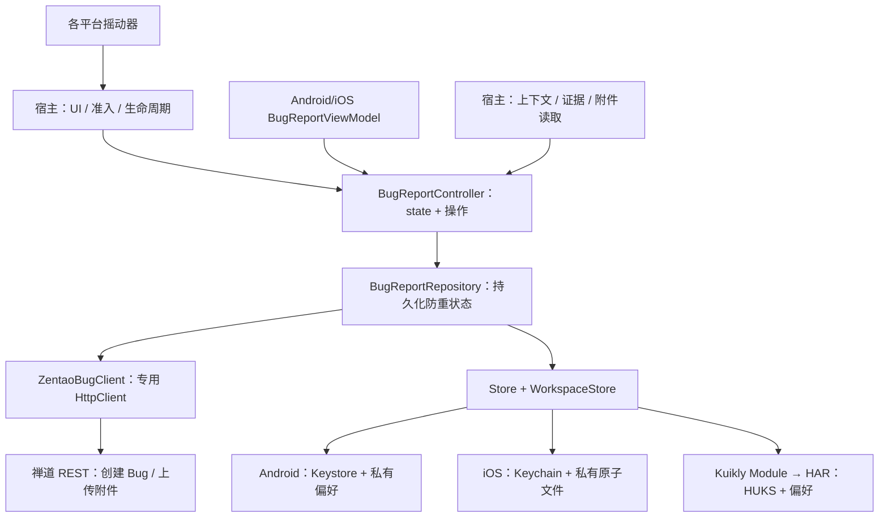
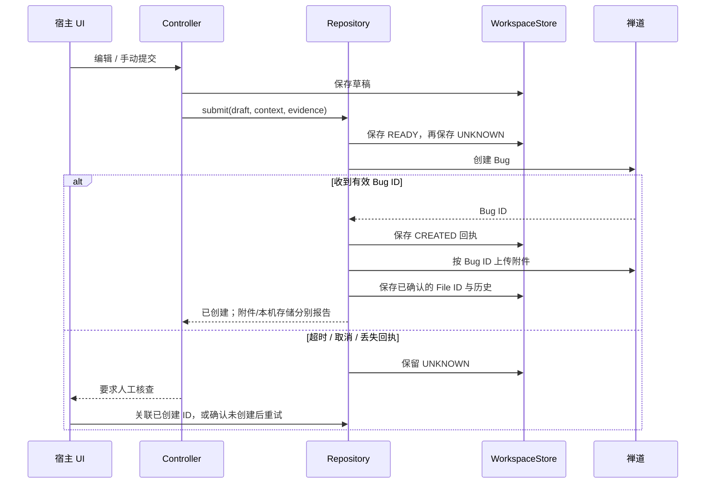
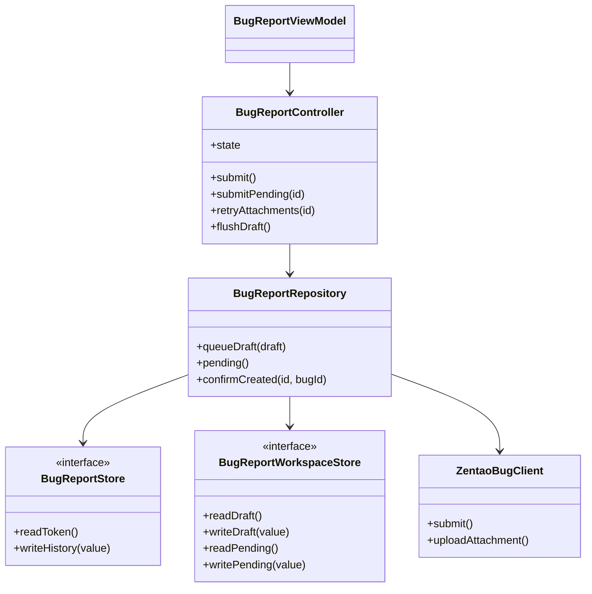

# GY CrossKit Debug Tools

> 2026-10-08 发布候选：Maven 0.2.0-rc.6；源码修复与 CI 配置准备完成，发布归档、严格公开检查和新坐标远程消费以本次 Release 结果为准；真实设备与宿主业务尚未验收。

2026-10-08 功能索引：core提供Controller/REST/存储与传感器，库没有CMP/Kuikly表单UI；A/i宿主消费core，debug-tools-kuikly仅提供OHOS桥。 详见[功能与平台差异](docs/功能与平台差异.md)，含固定基线、五入口矩阵、真实回归与未验收范围。当前发布组合：Maven 0.2.0-rc.6；未变OHOS HAR继续0.2.0-rc.3。各渠道消费与设备验收分别核对。

最终核对（2026-10-08）：最终审查重跑JVM35项；发布门禁修正后另实跑iOS普通存储2项（原2项Keychain跳过保留），正常签名App重新验证生产Keychain增改查删及清凭据保留history/settings/draft/pending。Android42项复用前轮结果，系统失败保护仍仅源码核对。 逐项时点与边界见[验证范围](docs/功能与平台差异.md#sdk系统与真实验证范围)。

Android、iOS、HarmonyOS 共用的 Bug 上报组件：草稿、提交状态、安全 Token、本机历史、摇动触发、页面轨迹、证据格式化和禅道 REST 协议。保留 `com.dgtang.debugtools.bugreport` API；表单 UI、品牌、导航和诊断采集由宿主提供。

历史预发布 Maven **0.2.0-rc.3**（`debug-tools` / `debug-tools-kuikly`）与 Release HAR **0.2.0-rc.3**：初始恢复期间阻止旧快照覆盖新凭据操作，鸿蒙桥严格拒绝 null 和错误参数类型。新标签Release/JitPack文件与新目录Maven实际消费已通过，OHPM仍审核、Release HAR fallback消费已通过，结果见 [完整审查](docs/完整审查.md)；后面的 rc.1/rc.2 为历史验收。

当前 Maven 为 `0.2.0-rc.6`，HAR 保持 `0.2.0-rc.3`；以上 rc.3 为历史说明。本版将 iOS 摇动冷却改为 CoreMotion 采样的单调时间戳，与 Android/OHOS 同样不受系统时间调整影响；阈值、冷却时长与生命周期保持原合同。

## 本版对齐范围

| 能力 | 当前范围 |
| --- | --- |
| 鸿蒙 Bug 上报 | 共用 Controller/Repository/REST，OHOS KLIB + Kuikly 薄桥 |
| 鸿蒙 Token 存储 | HUKS AES-256-GCM，随机 nonce，普通偏好只保存密文 |
| 鸿蒙摇一摇 | 真实注册回执、阈值/冷却、停止与销毁注销 |
| 三端附件 | 已知 Bug ID 后上传，失败可补传，未知结果先核查 |
| 三端草稿 | 自动保存用户输入，宿主关闭前可等待 flushDraft |
| 三端待提交恢复 | 持久化队列，手动提交；不因启动、联网或授权自动重发 |
| 本地化 | typed notice、内置中文/英文，宿主可映射资源 |

## 架构与调用流程







源码：[共用状态机](src/commonMain/kotlin/com/dgtang/debugtools/bugreport/BugReportController.kt)、[提交与恢复](src/commonMain/kotlin/com/dgtang/debugtools/bugreport/BugReportRepository.kt)、[REST](src/commonMain/kotlin/com/dgtang/debugtools/bugreport/ZentaoBugClient.kt)、[Kuikly 桥](debug-tools-kuikly/src/commonMain/kotlin/com/dgtang/debugtools/kuikly/DebugToolsModule.kt)、[原生 HAR](ohos/debug-tools-native)。

## 支持与安装

| 项目 | 当前范围 |
| --- | --- |
| 平台 | Android minSdk 24、iOS Arm64/Simulator Arm64/x64、OHOS Arm64；JVM 用于共用核心消费和测试 |
| 工具链 | Kotlin `2.2.21-1.0.0`、AGP 8.10.1、Gradle 8.11.1、Android JVM 11；Gradle JDK 17+ |
| 共用依赖 | coroutines `1.10.2-1.0.0`、serialization `1.9.1-1.0.0`、Ktor `3.3.3-1.1.0-04` |
| Android/iOS 包装 | lifecycle-viewmodel 2.10.0；OHOS 核心不依赖 AndroidX |
| 鸿蒙桥 | Kuikly `2.28.0-2.0.21-ohos`，HAR renderer `2.28.0` |
| 原生产物 | Android AAR、iOS/OHOS KLIB、OHOS HAR；没有独立 Pod/SPM/XCFramework |

三端使用 JitPack，配套依赖仓库配置见 [独立消费工程](verification-consumer/settings.gradle.kts)：

```kotlin
implementation("com.github.gycrosskit.debug-tools:debug-tools:0.2.0-rc.6")
```

三端固定预发布坐标如下（JitPack 与新版新目录远程消费通过，设备业务另验）：

```kotlin
commonMain.dependencies {
    implementation("com.github.gycrosskit.debug-tools:debug-tools:0.2.0-rc.6")
}
ohosArm64Main.dependencies {
    implementation("com.github.gycrosskit.debug-tools:debug-tools-kuikly:0.2.0-rc.6")
}
```

鸿蒙原生配套包为 `@gycrosskit/debug-tools-native@0.2.0-rc.3`。历史验收时 OHPM 已提交审核，精确版本曾 `NOTFOUND`、`next` 当时指向 rc.1；此为历史记录，不能代替当前 Registry 查询。固定归档为 [不可变 Release HAR](https://github.com/gycrosskit/debug-tools/releases/tag/0.2.0-rc.3)，SHA-256 为 `b65c2028968aa8e2b05b1032fbfdae3c66fe6d6834ebc89e72b2297b5c5da532`；不得把审核提交等同于 registry 已安装。配置、迁移键、手动恢复和生命周期例子见 [接入指南](docs/接入指南.md)；原生注册见 [HAR README](ohos/debug-tools-native/README.md)。

## 最小接入

```kotlin
// engineClient、target、store、hostDataSource 由宿主提供。
val repository = BugReportRepository(ZentaoBugClient(engineClient, target), store)
// Android/iOS 保留现有 ViewModelStore/Koin 所有权。
val model = BugReportViewModel(repository, hostDataSource)
// Kuikly 使用 BugReportController(pageScope, repository, hostDataSource)。
// 观察 state 并调用 openForm、updateTitle、submit 等操作。
```

宿主负责 HTTPS 目标、产品/分支、账号授权 UI、专用 TLS Engine、存储命名空间、证据与附件准入、脱敏、摇动开关、表单与导航。未开通使用 `BugReportTarget.Unavailable`。账号密码不落盘；远端创建成功与附件失败、本机记录失败分别表达。

`BugEvidenceFormatter` 只限长，不脱敏。组件不会自动截图、采集诊断或恢复联网后重发。Android Release 由宿主排除开发依赖；iOS/OHOS 由正式环境准入禁用，不创建或启动调试摇动器。

Controller 操作使用宿主 UI/Page 的串行 scope；Store 的 suspend 签名不代表可以在任意线程访问平台对象。Android/iOS detector 在主线程生命周期调用；Kuikly Store 与摇动使用所属 Page 的协程，销毁在相同 Kuikly Context 调用 `dispose()`。

## 开发与验证

历史99项Kotlin测试、4项鸿蒙原生模拟测试和产物范围见[开发与验证](docs/开发与验证.md)。2026-10-08候选另有JVM35/Android42项回归与实际Xcode Simulator App-hosted生产Keychain增改查删通过；旧standalone跳过测试没有计为PASS。系统锁屏/失败注入、HUKS/Keystore、真实传感器和禅道写入仍待验收，精确范围见[功能与平台差异](docs/功能与平台差异.md)。

```bash
bash gradlew --no-daemon --max-workers=1 --no-parallel \
  jvmTest testDebugUnitTest iosSimulatorArm64Test \
  compileKotlinIosArm64 compileKotlinIosX64 \
  :debug-tools-kuikly:compileKotlinOhosArm64 publishAllPublicationsToStagingRepository
bash scripts/export-maven.sh
```

staging 位于 `build/maven/<版本>`，不用 mavenLocal。`verification-consumer` 默认从 JitPack 精确坐标消费；候选可通过外置临时 init script 只替换本组件 group 为 staging。打包入口保留不可变 Release Maven 归档与 SHA 校验方案；源码可从 Git 标签读取。

组件权利人授权以 [Apache-2.0](LICENSE) 发布，第三方依赖遵循各自许可证。
[GitHub](https://github.com/gycrosskit/debug-tools) · [Release](https://github.com/gycrosskit/debug-tools/releases) · [Issues](https://github.com/gycrosskit/debug-tools/issues)。反馈只提交脱敏复现信息。

## 0.1.3 发布候选

提交开始时冻结草稿与自动证据，异步采集上下文期间重新打开表单不会替换正在提交的证据。
公开状态仍不暴露自动证据；导航切换与远端成功、本机历史失败语义保持。

本轮 Android 22 项与 Simulator 23 项实际测试通过，另 2 项 Keychain 测试仍明确跳过；iOS arm64 编译通过。
证据冻结回归用真实 ViewModel/MockEngine 先红后绿，没有发送真实 Bug 请求。

| 该版本配套渠道 | 配套版本 |
| --- | --- |
| Maven | `0.1.3` |

没有独立 Pod/SPM/HAR；Keychain 两项 runner 限制仍保留。候选已完成发布与新版本远程消费；设备行为不由编译/链接推断。

## 0.1.3 发布与远程验收

Fresh macOS staging 与归档解包复验均通过，全部 5 个 publication 的声明文件四类哈希、四类 sidecar、Apache-2.0 POM 及同名 available-at 目标身份均已校验。Maven 归档 SHA-256：`59fa9aadd5d869bed4f456937acf1e65316357d9d78accb80371a833da76b9de`。

Maven `0.1.3`；没有额外原生源码发布渠道。

不可变标签与 prerelease 已发布，所有 Release 附件重下载 SHA 与清单匹配。JitPack 新版本最终 ok/isTag/public 且 commit 匹配 tag，全部 5 module、6 个文件引用、5 个 available-at 的 HTTP/四类声明 hash/身份验证通过。新版真实远程 consumer 已通过；设备与业务 SDK 动作未验。

精确 JitPack 0.1.3 新目录消费者：29 tasks / 28s，Android AAR、iOS 三架构编译及 simulator Framework。首次 fresh staging 因 SDK 路径缺省失败，归档入口补 ANDROID_HOME 默认值后定向重跑通过；没有重复整仓验证。

实际日志与 JSON 账单位于 `build/remote-library-review/`。真实设备、业务账号登录/聊天/直播/PiP、权限 UI、真实 Bug/通知发送未执行。

## 0.2.0-rc.1 发布与远程验收

[发布 PR #7](https://github.com/gycrosskit/debug-tools/pull/7) 已合并；不可变 [0.2.0-rc.1 Release](https://github.com/gycrosskit/debug-tools/releases/tag/0.2.0-rc.1) 指向 `c173ef3bb7db01d085382605947e91a4633868f1`。Maven/HAR/清单三个附件重下载字节一致。

JitPack 最终 ok/isTag/public、commit 匹配；九模块 POM/GMM、全部变体文件大小与声明四类 hash、内部依赖和 available-at 身份通过。九个产物的公开 MD5/SHA1 sidecar 通过；SHA256/SHA512 sidecar 返回 404，未将其计为下载验证通过。

全新 Maven 坐标消费者从 JitPack 下载，Android、iOS Arm64/x64/Simulator Framework 和 OHOS 编译通过，28s、13 个任务全部执行；没有 init script、staging、mavenLocal 或源码替换。

OHPM 已提交审核，当前查询 `NOTFOUND`，未上架。鸿蒙使用 [同版 Release HAR](https://github.com/gycrosskit/debug-tools/releases/download/0.2.0-rc.1/debug-tools-native-0.2.0-rc.1.har)，SHA-256：`bedd05d52bed6d1a44fbd58a59748df30845c74ac463e8c06baf08d37a87970b`。Maven 归档 SHA-256：`7dec314543f45f8ef38b9a08b9c47b742d143c5a740d58e0deb7e2bb30e6d951`。

生产宿主已开始接入；构建与接入结果由宿主接入文档记录。真实安全存储、传感器、禅道写入和业务设备验收未执行，不能从本段推断。

## 0.2.0-rc.2 本轮测试与远程验收

2026-10-05：本轮自有源码和公开 API 审查、关键回归与受影响平台编译通过；真实 JitPack `0.2.0-rc.2` 的最终标签提交、9 个 publications 的 POM/Module、所有变体文件大小与四种声明哈希、内部精确版本及 available-at 均通过。Release Maven 归档重新下载 SHA-256 为 `cd45b6f66ce2bb7bb955c541cd56d65a04e05dabc4d25cddd1ee100672bf87dd`。公开 MD5/SHA-1 sidecar 通过；SHA-256/SHA-512 sidecar 的 HTTP 404 记录为渠道缺失。

干净消费工程使用固定远程版本，没有本地 Maven、includeBuild 或其他组件源码替代；通过现有入口的 Android/iOS / OHOS 编译和相应最终链接。

完整回归范围、精简原则、注释契约与仍需设备/业务验收的边界见 [14 个功能组件测试与 API 审查](https://github.com/gycrosskit/.github/blob/main/docs/组件测试与API审查.md)。源码测试与远程消费不代替真机和厂商业务验收。

## 自动回归

[Source regression](.github/workflows/regression.yml) 的当前工作树候选按事件分阶段：PR 先判断变更范围，仅源码变更运行已有 Android/Native 测试与编译；纯文档 PR 和 `main` push 只运行轻量脚本/配置检查。手动运行不填版本时执行源码回归，未知路径保守按源码处理。线上生效与耗时以实际 Actions 运行为准。

[Release validation](.github/workflows/release-validation.yml) 在 Maven Release 发布或手动填写精确已发布版本时，`verify-public` 统一校验一次冻结归档、精确 tag/commit、完整 publication 清单和公开文件；通过后 Android/Native 独立消费者从 JitPack 解析该版本。PR 不再反复消费旧基线；不使用 `mavenLocal`、本库源码或归档替换远程依赖。此流程不发布二进制。

GitHub-hosted runner 的实际结果以 Actions 为准；没有 DevEco/ohpm runner，因此 HAR 构建、ohpm Registry 安装、完整原生 SDK 集成和真机业务验收仍按既有验证文档执行，不能由这些 job 的成功代算。

阶段、缓存、有限网络重试、失败记录与证据边界见[共用 CI 规则](https://github.com/gycrosskit/.github/blob/main/docs/持续集成门禁.md)；本库实际平台命令以 workflow 为准。源码通过、远程消费、HAR/ohpm 与设备验收分别记录。

公网核验同步组织 `templates/check-public-maven.py`：使用冻结归档给出的完整 publications 清单，核对 JitPack tag/commit、每个公开 POM/Module、全部声明变体字节大小和四类哈希、内部精确版本及 `available-at`；MD5/SHA-1 sidecar 必须匹配。SHA-256/SHA-512 sidecar 的 HTTP 404 单独输出为渠道缺失，不计为校验通过。

历史 `0.2.0-rc.3` 基线的 JVM JAR 实测 class major 65，需要 Java 21；该基线当时只远程消费 Android/iOS/OHOS，不能把 Android 的 JVM 11 target 或源码 `jvmTest` 成功解释为 JVM 制品兼容。其他版本以其精确制品与消费结果为准。
